# Ouroboros 학습 경로 (Learning Paths)

**Ouroboros의 순환 구조를 이해하고, 단계별로 스킬을 익혀보세요.**

---

## 왜 학습 순서가 중요한가

Ouroboros는 선형 도구가 아닌 **순환 워크플로우 (Circular Workflow)** 입니다. `Interview → Seed → Run → Evaluate → Evolve`의 각 단계는 이전 단계의 산출물을 입력으로 받아 다음 단계로 전달합니다. 순서대로 학습해야 전체 사이클을 올바르게 이해할 수 있는 세 가지 이유가 있습니다.

1. **의존성 (Dependency)**: 각 단계의 산출물이 다음 단계의 필수 입력입니다. `Run`을 실행하려면 `Seed YAML`이 있어야 하고, `Evaluate`를 실행하려면 실행된 코드가 있어야 합니다. 순서를 건너뛰면 필요한 컨텍스트가 없어 실행이 실패합니다.
2. **개념적 기반 (Conceptual Foundation)**: `Interview`를 통해 모호함을 줄이는 과정을 먼저 경험해야 `Seed`의 가치를 이해할 수 있습니다. `Evaluate`의 3단계 파이프라인을 먼저 이해해야 `Evolve`의 수렴 조건이 의미 있게 다가옵니다.
3. **진화적 개선 (Evolutionary Improvement)**: Ouroboros의 핵심은 반복을 통한 수렴입니다. 단계를 순서대로 경험해야 각 루프가 어떻게 품질을 높이는지, 언제 루프를 멈춰야 하는지 판단할 수 있습니다.

---

## 초급 경로: 첫 30분 — 첫 Seed 사양 만들기

> **목표**: Ouroboros를 설치하고 첫 번째 Seed 사양을 생성한다
> **소요 시간**: 30분
> **대상**: Ouroboros를 처음 접하는 개발자 및 PM

---

### 스킬 1: setup (설치)

| 항목 | 내용 |
|------|------|
| **명령어** | `ooo setup` 또는 `/ouroboros:setup` |
| **왜 첫 번째인가** | MCP 서버 등록과 환경 검증이 모든 스킬의 시작점입니다. 이 단계 없이는 다른 스킬을 실행할 수 없습니다. |
| **입력** | 없음 |
| **산출물** | MCP 서버 등록 완료, `CLAUDE.md` 설정 |
| **다음 스킬에 전달** | 설정된 환경 (MCP 연결 상태) |
| **소요 시간** | 5분 |

---

### 스킬 2: welcome (첫 화면)

| 항목 | 내용 |
|------|------|
| **명령어** | `ooo welcome` 또는 `/ouroboros:welcome` |
| **왜 두 번째인가** | 설치 후 시스템 상태를 확인하고 사용 가능한 기능을 파악합니다. 첫 사용 시 방향을 잡는 나침반 역할을 합니다. |
| **입력** | 없음 |
| **산출물** | 환경 상태 보고서, 추천 다음 행동 목록 |
| **다음 스킬에 전달** | 현재 환경에서 가능한 작업 범위 파악 |
| **소요 시간** | 2분 |

---

### 스킬 3: tutorial (튜토리얼)

| 항목 | 내용 |
|------|------|
| **명령어** | `ooo tutorial` 또는 `/ouroboros:tutorial` |
| **왜 세 번째인가** | 5분 핸즈온 경험으로 전체 워크플로우를 직접 체험합니다. 이론보다 실습으로 먼저 감을 잡는 것이 학습에 효과적입니다. |
| **입력** | 없음 |
| **산출물** | `Interview → Seed → Run → Evaluate` 전체 사이클 체험 완료 |
| **다음 스킬에 전달** | 전체 흐름에 대한 직관적 이해 |
| **소요 시간** | 5분 |

---

### 스킬 4: interview (소크라테스적 인터뷰)

| 항목 | 내용 |
|------|------|
| **명령어** | `ooo interview "주제"` 또는 `/ouroboros:interview "주제"` |
| **왜 네 번째인가** | 모호한 아이디어를 명확한 요구사항으로 변환합니다. **모호성 점수 (Ambiguity Score)** 가 0.2 이하가 될 때까지 소크라테스적 질문을 통해 숨겨진 가정을 드러냅니다. |
| **입력** | 프로젝트 아이디어 (자유 형식 문자열) |
| **산출물** | 인터뷰 세션 (Q&A 기록, 모호성 점수, 세션 ID) |
| **다음 스킬에 전달** | 세션 ID → `ooo seed`의 입력으로 사용 |
| **소요 시간** | 10분 |

---

### 스킬 5: seed (사양 결정화)

| 항목 | 내용 |
|------|------|
| **명령어** | `ooo seed` 또는 `/ouroboros:seed` |
| **왜 다섯 번째인가** | 인터뷰 결과를 **불변 YAML (Immutable YAML)** 로 결정화합니다. 9개 컴포넌트로 구성된 Seed 파일이 이후 모든 실행의 기반이 됩니다. |
| **입력** | 인터뷰 세션 ID |
| **산출물** | Seed YAML 파일 (9개 컴포넌트: 목표, 제약, 성공 기준 등) |
| **다음 스킬에 전달** | Seed YAML → `ooo run`의 입력으로 사용 |
| **소요 시간** | 5분 |

> **Tip**: 초급 경로를 마치면 Seed 사양이 생성됩니다. 이것이 AI가 코드를 작성하기 위한 "설계도"입니다. 좋은 Seed는 좋은 인터뷰에서 나옵니다. `ooo interview`에서 충분히 대화를 나눠 모호성을 낮추는 데 시간을 투자하세요.

---

## 중급 경로: 첫 번째 완전 사이클 — 사양에서 검증까지

> **목표**: Seed 사양으로 코드를 생성하고 3단계 검증까지 완료한다
> **소요 시간**: 1~2시간
> **대상**: 초급 경로를 마친 사용자

---

### 스킬 6: run (실행)

| 항목 | 내용 |
|------|------|
| **명령어** | `ooo run` 또는 `/ouroboros:run` |
| **왜 여섯 번째인가** | Seed 사양을 기반으로 AI가 코드를 생성합니다. Seed가 충분히 명확할 때만 의미 있는 코드가 생성됩니다. |
| **입력** | Seed YAML 파일 (세션 컨텍스트에서 자동 참조) |
| **산출물** | 생성된 코드, 실행 결과 |
| **다음 스킬에 전달** | 실행된 코드 → `ooo evaluate`의 입력으로 사용 |
| **소요 시간** | 프로젝트 규모에 따라 다름 (5~30분) |

---

### 스킬 7: evaluate (3단계 검증)

| 항목 | 내용 |
|------|------|
| **명령어** | `ooo evaluate` 또는 `/ouroboros:evaluate` |
| **왜 일곱 번째인가** | 생성된 코드가 Seed 사양을 충족하는지 3단계로 검증합니다. 단순 테스트 통과가 아닌 **의미론적 일치 (Semantic Alignment)** 를 측정합니다. |
| **입력** | 실행된 코드, Seed YAML (세션 컨텍스트에서 자동 참조) |
| **산출물** | 검증 보고서 (Stage 1~3 점수, 통과/실패 판정, 개선 제안) |
| **다음 스킬에 전달** | 통과 시 완료, 실패 시 `ooo evolve`로 개선 진행 |
| **소요 시간** | 5~15분 |

> **Note**: Evaluate의 3단계 파이프라인은 비용 구조가 다릅니다. **Stage 1 (기계적 검증)** 은 무료, **Stage 2 (의미론적 검증)** 는 Standard 모델 비용, **Stage 3 (합의 검증)** 은 필요할 때만 Frontier 모델 비용이 발생합니다.

---

### 스킬 8: status (세션 상태)

| 항목 | 내용 |
|------|------|
| **명령어** | `ooo status` 또는 `/ouroboros:status` |
| **왜 중급에서 배우는가** | 여러 스킬을 실행하다 보면 현재 세션이 어느 단계에 있는지, 드리프트 (Drift) 가 얼마나 발생했는지 파악할 필요가 생깁니다. |
| **입력** | 세션 ID (없으면 현재 활성 세션 자동 참조) |
| **산출물** | 세션 진행 보고서, 드리프트 측정값, 권장 다음 행동 |
| **다음 스킬에 전달** | 현재 상태 파악 후 적절한 스킬 선택 |
| **소요 시간** | 1~2분 |

> **Tip**: 중급 경로에서 가장 중요한 것은 `Evaluate`의 3단계 파이프라인을 이해하는 것입니다. Stage 1(기계적)은 무료, Stage 2(의미론적)는 Standard 비용, Stage 3(합의)는 필요할 때만 Frontier 비용이 발생합니다. 이 구조를 이해하면 비용을 효율적으로 관리할 수 있습니다.

---

## 고급 경로: 진화적 개발 — 수렴까지 반복

> **목표**: 진화 루프, 자동 반복, 정체 탈출을 마스터한다
> **소요 시간**: 반나절
> **대상**: 중급 경로를 마친 사용자

---

### 스킬 9: evolve (진화)

| 항목 | 내용 |
|------|------|
| **명령어** | `ooo evolve` 또는 `/ouroboros:evolve` |
| **왜 고급인가** | 검증 결과를 바탕으로 사양과 구현을 함께 진화시킵니다. **온톨로지 유사도 (Ontological Similarity)** 가 0.95 이상이 될 때까지 세대별 개선을 반복합니다. |
| **입력** | 이전 세대의 Seed YAML, 검증 보고서 |
| **산출물** | 개선된 다음 세대 Seed YAML, 변경 이유 기록 (계보, Lineage) |
| **다음 스킬에 전달** | 새 Seed YAML → `ooo run` → `ooo evaluate` 루프 반복 |
| **소요 시간** | 세대당 10~20분 |

---

### 스킬 10: unstuck (정체 탈출)

| 항목 | 내용 |
|------|------|
| **명령어** | `ooo unstuck` 또는 `/ouroboros:unstuck` |
| **왜 고급인가** | 진화 루프가 같은 문제에서 반복적으로 막힐 때 사용합니다. 5개의 **페르소나 (Persona)** 가 각기 다른 관점에서 새로운 해결책을 제안합니다. |
| **입력** | 현재 세션 컨텍스트, 막힌 문제 설명 (선택 사항) |
| **산출물** | 5개 페르소나 중 선택된 관점에서의 새로운 접근법 |
| **다음 스킬에 전달** | 새 관점 → `ooo evolve`에 주입하여 루프 재개 |
| **소요 시간** | 5~10분 |

**5개 페르소나:**

| 페르소나 | 특징 | 언제 사용하는가 |
|----------|------|----------------|
| `hacker` | 빠르게 동작하는 것을 최우선으로 | 완벽함보다 우선 돌아가게 만들고 싶을 때 |
| `researcher` | 근본 원인과 이론적 기반 탐구 | 왜 안 되는지 깊이 이해하고 싶을 때 |
| `simplifier` | 복잡성 제거, 최소한의 솔루션 | 너무 복잡해진 설계를 단순화할 때 |
| `architect` | 시스템 전체 구조와 확장성 고려 | 장기적인 아키텍처 결정이 필요할 때 |
| `contrarian` | 현재 접근법에 의도적으로 반론 | 가정에 도전하고 맹점을 찾을 때 |

---

### 스킬 11: ralph (자동 반복 루프)

| 항목 | 내용 |
|------|------|
| **명령어** | `ooo ralph` 또는 `/ouroboros:ralph` |
| **왜 고급인가** | `실행 → 검증 → 수정 → 반복`을 수동 개입 없이 자동으로 반복합니다. 완료 조건이 명확할 때 가장 강력한 도구입니다. |
| **입력** | 현재 세션 컨텍스트 (Seed YAML, 목표 상태) |
| **산출물** | 검증 통과 또는 최대 반복 횟수 도달 시의 최종 상태 |
| **다음 스킬에 전달** | 통과 시 완료 / 정체 시 `ooo unstuck`으로 에스컬레이션 |
| **소요 시간** | 자동 실행 (완료까지 수십 분~수 시간) |

> **Tip**: `ooo ralph`는 강력하지만 Seed 사양이 명확하지 않으면 잘못된 방향으로 계속 반복할 수 있습니다. 반드시 초급 경로의 `ooo interview`와 `ooo seed`를 충분히 거친 후 사용하세요.

---

## 시나리오별 스킬 조합

| 시나리오 | 추천 스킬 순서 | 설명 |
|----------|---------------|------|
| 새 프로젝트 시작 | `setup` → `interview` → `seed` → `run` → `evaluate` | 깨끗한 상태에서 전체 사이클 완주 |
| 기존 프로젝트 개선 | `brownfield` → `interview` → `seed` → `run` → `evaluate` | 기존 코드 컨텍스트 주입 후 진행 |
| PRD 작성 | `pm` → (산출물: PRD 문서) | PM 특화 인터뷰 → PRD 자동 생성 |
| 빠른 품질 확인 | `qa` | 단일 패스 품질 판정 (PASS / REVISE / FAIL) |
| 반복 자동화 | `ralph` | 자동으로 실행 → 검증 → 수정 루프 반복 |
| 막힌 상태 탈출 | `unstuck` | 5개 페르소나 중 선택하여 새 관점 획득 |
| 진화적 고도화 | `evolve` → `evaluate` → `evolve` (반복) | 온톨로지 수렴까지 세대별 개선 |

---

## 완료 조건 체크리스트

### 초급

- [ ] `ooo setup`으로 환경 설정 완료
- [ ] `ooo welcome`으로 시스템 상태 확인
- [ ] `ooo tutorial`로 전체 워크플로우 체험
- [ ] `ooo interview`로 첫 인터뷰 완료 (모호성 점수 0.2 이하 달성)
- [ ] `ooo seed`로 첫 Seed YAML 생성

### 중급

- [ ] Seed로 `ooo run` 실행하여 코드 생성
- [ ] `ooo evaluate`로 3단계 검증 완료
- [ ] 검증 결과 보고서 해석 가능 (Stage 1~3 점수 의미 이해)
- [ ] `ooo status`로 세션 진행 상태 조회

### 고급

- [ ] `ooo evolve`로 최소 2세대 진화 실행
- [ ] `ooo unstuck`으로 페르소나 전환 경험 (5개 중 2개 이상)
- [ ] `ooo ralph`로 자동 반복 루프 완료
- [ ] 수렴 조건 (유사도 ≥ 0.95) 도달 경험

---

> 학습 경로에 대한 궁금한 점이 있다면, [용어 사전](02-glossary.md)에서 개념을 확인하거나 [시작하기](categories/getting-started.md)에서 첫 스킬부터 따라해 보세요.
