# 요구사항 정의 (Requirements Definition)

## 카테고리 소개

소크라테스는 2,500년 전 "너 자신을 알라"고 가르쳤습니다. Ouroboros의 요구사항 정의 카테고리는 바로 이 철학에서 출발합니다. AI에게 무언가를 만들라고 지시하기 전에, 먼저 무엇을 만들어야 하는지를 명확히 아는 것이 선행되어야 합니다. 대부분의 AI 코딩 실패는 출력이 아닌 입력에서 발생합니다. 모호한 요구사항은 모호한 결과물을 낳고, 그 결과물을 고치는 데 드는 비용은 처음부터 명확히 했을 때보다 훨씬 크습니다.

소크라테스적 명확화(Socratic Clarity)란 단순한 질문-답변 반복이 아닙니다. 모호함을 수치로 측정하고, 그 수치가 허용 임계값(0.2 이하) 아래로 내려갈 때까지 체계적으로 질문을 이어가는 방식입니다. 이 과정에서 사용자는 자신이 미처 생각하지 못했던 가정들을 발견하게 되며, 그 가정들이 명시적인 제약 조건과 수용 기준으로 변환됩니다. Ouroboros는 이 변환 과정을 자동화하고 수치화합니다.

요구사항 정의 카테고리의 핵심 산출물은 Seed YAML입니다. 인터뷰를 통해 수집된 정보는 구조화된 9개 컴포넌트로 결정화(crystallize)되어 불변의 방향(Direction)으로 저장됩니다. 목표(goal), 제약 조건(constraints), 수용 기준(acceptance_criteria)은 한번 확정되면 합의 없이는 변경할 수 없습니다. 이는 의도적인 설계입니다. 방향이 흔들리면 모든 후속 작업이 표류하기 때문입니다.

기존 코드베이스가 있는 경우에는 Brownfield 스캔이 선행됩니다. AI가 현재 시스템의 구조와 의존성을 파악한 후 인터뷰에 임하면, 질문의 깊이가 달라집니다. 코드에서 읽어낼 수 있는 사실(`[from-code]`)과 사람이 결정해야 하는 판단(`[from-user]`)을 구분함으로써, 인터뷰 시간을 진짜 중요한 의사결정에만 집중시킵니다.

---

## 이 카테고리의 스킬 한눈에 보기

| 스킬 | 명령어 | 핵심 기능 | 난이도 |
|------|--------|-----------|--------|
| **interview** | `ooo interview "주제"` | 소크라테스적 질문으로 모호함 ≤ 0.2 달성 | 초급 |
| **seed** | `ooo seed [session_id]` | 인터뷰 결과를 불변 YAML로 결정화 | 초급 |
| **pm** | `ooo pm "주제"` | PM 맥락의 인터뷰로 PRD 문서 생성 | 중급 |
| **brownfield** | `ooo brownfield` | 기존 저장소 스캔 및 기본 컨텍스트 등록 | 중급 |

---

## 추천 실행 순서

### 흐름도



### 실행 순서 설명

1. **신규 프로젝트 (Greenfield)**: `interview` → `seed` 순서로 진행합니다. 인터뷰에서 모호함 점수가 0.2 이하로 내려가면 `seed`로 결정화합니다.
2. **기존 코드가 있는 경우 (Brownfield)**: `brownfield` → `interview` → `seed` 순서로 진행합니다. 코드 컨텍스트를 먼저 등록하면 인터뷰 품질이 높아집니다.
3. **PM/기획 문서가 필요한 경우**: `interview` 또는 `pm` 중 선택합니다. `pm`은 PRD 형식의 문서를 직접 생성합니다.

---

## 관련 카테고리

- **시작하기**: `setup`으로 환경을 구성한 뒤 이 카테고리를 시작하세요.
- **개발 실행**: `seed` 생성 후 `run`으로 실제 실행에 진입합니다.
- **품질 검증**: 실행 완료 후 `evaluate`로 결과물을 검증합니다.

---

## 스킬 상세

---

### interview — 소크라테스적 인터뷰

**소크라테스식 질문으로 모호한 아이디어를 실행 가능한 요구사항으로 변환합니다.**

#### 명령어

```bash
# CLI (플러그인 없이)
ooo interview "인증 시스템을 만들고 싶어"

# 슬래시 명령어 (MCP 연결 시)
/ouroboros:interview "인증 시스템을 만들고 싶어"
```

#### 핵심 개념: 모호함 공식

```
Ambiguity = 1 - Σ(clarity_i × weight_i)
```

인터뷰는 이 값이 **0.2 이하**가 될 때까지 계속됩니다.

**Greenfield(신규) 가중치:**
| 차원 | 가중치 |
|------|--------|
| Goal Clarity (목표 명확도) | 40% |
| Constraint Clarity (제약 명확도) | 30% |
| Success Criteria Clarity (성공 기준 명확도) | 30% |

**Brownfield(기존 코드) 추가 차원:**
| 차원 | 가중치 (조정) |
|------|--------------|
| Context Clarity (컨텍스트 명확도) | 15% |
| Goal Clarity | 35% |
| Constraint Clarity | 25% |
| Success Criteria Clarity | 25% |

#### 3-Path 라우팅

`interview`는 각 질문에 대해 세 가지 답변 경로를 자동으로 선택합니다.

| 경로 | 이름 | 동작 |
|------|------|------|
| PATH 1 | Code Confirmation | 코드베이스를 읽고 사실을 확인 후 답변 |
| PATH 2 | Human Judgment | 사용자에게 직접 질문 |
| PATH 3 | Code + Judgment | 코드를 읽은 뒤 사용자의 판단을 추가 질문 |

**Dialectic Rhythm Guard**: 코드 전용 답변(PATH 1)이 3회 연속되면 강제로 사용자 상호작용(PATH 2 또는 3)으로 전환합니다. 코드에서 모든 것을 읽어내려는 과도한 자동화를 방지합니다.

#### 실행 모드

**MCP 모드** (MCP 서버 연결 시):
- `ouroboros_interview` 도구 사용
- 세션 상태가 서버에 영속적으로 저장됨
- 중단 후 재개 가능

**폴백 모드** (MCP 없이):
1. `skills/interview/SKILL.md` 파일을 읽음
2. `src/ouroboros/agents/socratic-interviewer.md` 에이전트 역할을 채택
3. 동일한 소크라테스 인터뷰 진행 (세션 저장 없음)

#### 관련 에이전트

| 에이전트 | 역할 |
|----------|------|
| `socratic-interviewer` | 핵심 인터뷰어. 질문 생성 전담 |
| `breadth-keeper` | 인터뷰 범위가 지나치게 좁아지지 않도록 폭 유지 |
| `seed-closer` | 모호함 임계값 도달 시 seed 전환 준비 |

#### 출력

- 질문-답변 쌍으로 구성된 인터뷰 세션
- 각 단계별 모호함 점수
- 최종 모호함 ≤ 0.2 달성 시 `seed` 진행 권유

#### 소스

- 스킬: [`skills/interview/SKILL.md`](../../../ouroboros/skills/interview/SKILL.md)
- 에이전트: [`src/ouroboros/agents/socratic-interviewer.md`](../../../ouroboros/src/ouroboros/agents/socratic-interviewer.md)
- 에이전트: [`src/ouroboros/agents/breadth-keeper.md`](../../../ouroboros/src/ouroboros/agents/breadth-keeper.md)
- 에이전트: [`src/ouroboros/agents/seed-closer.md`](../../../ouroboros/src/ouroboros/agents/seed-closer.md)

**난이도**: 초급 | **예상 소요 시간**: 10–30분

---

### seed — 사양 결정화

**인터뷰 세션을 불변의 YAML 사양서로 결정화합니다.**

#### 명령어

```bash
# CLI (플러그인 없이)
ooo seed
ooo seed abc123   # 특정 세션 ID 지정

# 슬래시 명령어 (MCP 연결 시)
/ouroboros:seed
/ouroboros:seed abc123
```

#### 핵심 개념: Seed YAML 9개 컴포넌트


**불변 컴포넌트 (Direction)**:
- `goal`: 달성하려는 목표 — 합의 없이 변경 불가
- `constraints`: 기술적·비즈니스 제약 — 합의 없이 변경 불가
- `acceptance_criteria`: 완료 기준 — 합의 없이 변경 불가

**진화 가능 컴포넌트 (Structure)**:
- `ontology_schema`: 도메인 개념과 관계 — 합의 후 진화 가능
- `evaluation_principles`: 평가 기준
- `exit_conditions`: 종료 조건

**선택 컴포넌트 (Context)**:
- `task_type`: 작업 유형 (기본값: `"code"`)
- `brownfield_context`: 기존 코드 컨텍스트 (선택)

**메타데이터 (Meta)**:
- `metadata`: 버전, 타임스탬프, 세션 ID 등

#### 실행 모드

**MCP 모드** (MCP 서버 연결 시):
- `ouroboros_generate_seed` 도구 사용
- 세션 데이터를 자동으로 불러와 YAML 생성
- `~/.ouroboros/seeds/` 에 저장

**폴백 모드** (MCP 없이):
1. `skills/seed/SKILL.md` 파일을 읽음
2. `src/ouroboros/agents/seed-architect.md` 에이전트 역할 채택
3. `src/ouroboros/agents/ontologist.md` 에이전트와 협력하여 온톨로지 구성
4. YAML을 직접 생성하여 출력

#### 관련 에이전트

| 에이전트 | 역할 |
|----------|------|
| `seed-architect` | Seed YAML 구조 설계 및 생성 |
| `ontologist` | 도메인 개념과 관계를 온톨로지로 모델링 |

#### 출력

- 9개 컴포넌트를 포함한 Seed YAML 파일
- 저장 경로: `~/.ouroboros/seeds/{session_id}.yaml`

#### 소스

- 스킬: [`skills/seed/SKILL.md`](../../../ouroboros/skills/seed/SKILL.md)
- 에이전트: [`src/ouroboros/agents/seed-architect.md`](../../../ouroboros/src/ouroboros/agents/seed-architect.md)
- 에이전트: [`src/ouroboros/agents/ontologist.md`](../../../ouroboros/src/ouroboros/agents/ontologist.md)

**난이도**: 초급 | **예상 소요 시간**: 5분

---

### pm — PM 인터뷰

**제품 관리자 맥락에서 인터뷰를 진행하고 PRD(제품 요구사항 문서)를 생성합니다.**

#### 명령어

```bash
# CLI (플러그인 없이)
ooo pm "신규 결제 플로우 개선"

# 슬래시 명령어 (MCP 연결 시)
/ouroboros:pm "신규 결제 플로우 개선"
```

#### 핵심 개념

`pm`은 `interview`의 PM 특화 변형입니다. 기술적 구현보다 비즈니스 가치, 사용자 스토리, 성공 지표에 초점을 맞춥니다. 질문 자동 분류 시스템이 PM 맥락에 맞는 질문 유형을 선택합니다.

**interview와의 차이점:**
| 항목 | interview | pm |
|------|-----------|-----|
| 초점 | 기술 요구사항 | 비즈니스 + 사용자 요구사항 |
| 출력 | Seed YAML (→ seed) | PRD 문서 |
| MCP 도구 | `ouroboros_interview` | `ouroboros_pm_interview` |
| 질문 스타일 | 구현 지향 | 가치/임팩트 지향 |

#### 실행 모드

**MCP 모드** (MCP 서버 연결 시):
- `ouroboros_pm_interview` 도구 사용 (interview와 별도 도구)
- PM 맥락에 최적화된 질문 분류 자동 적용
- PRD 형식으로 직접 출력

**폴백 모드** (MCP 없이):
1. `skills/pm/SKILL.md` 파일을 읽음
2. `src/ouroboros/agents/socratic-interviewer.md` 에이전트를 PM 컨텍스트로 채택
3. PRD 형식에 맞춰 인터뷰 진행 및 문서 생성

#### 출력

- PRD (Product Requirements Document) 형식의 문서
- 포함 내용: 배경, 목표, 사용자 스토리, 기능 요구사항, 비기능 요구사항, 성공 지표

#### 소스

- 스킬: [`skills/pm/SKILL.md`](../../../ouroboros/skills/pm/SKILL.md)
- 에이전트: [`src/ouroboros/agents/socratic-interviewer.md`](../../../ouroboros/src/ouroboros/agents/socratic-interviewer.md) (PM 컨텍스트)

**난이도**: 중급 | **예상 소요 시간**: 15–30분

---

### brownfield — 기존 코드 스캔

**기존 저장소를 스캔하여 인터뷰 세션에 코드 컨텍스트를 자동으로 주입합니다.**

#### 명령어

```bash
# CLI (플러그인 없이) — 현재 디렉토리 스캔
ooo brownfield

# 슬래시 명령어 (MCP 연결 시)
/ouroboros:brownfield
```

#### 핵심 개념

신규 기능을 기존 코드베이스에 추가할 때, AI는 현재 시스템 상태를 모릅니다. `brownfield`는 이 문제를 해결합니다. 저장소를 스캔하여 구조, 주요 파일, 의존성을 파악한 뒤 `BrownfieldContext` 객체로 등록합니다. 이후 `interview` 실행 시 이 컨텍스트가 자동으로 주입됩니다.

**BrownfieldContext 구성 요소:**
| 항목 | 설명 |
|------|------|
| `repo_structure` | 디렉토리 트리 및 주요 파일 목록 |
| `key_files` | 핵심 진입점, 설정 파일 |
| `dependencies` | 패키지 의존성 목록 |
| `tech_stack` | 감지된 기술 스택 |

**인터뷰 내 경로 구분:**
- `[from-code]`: 코드에서 읽어낸 사실 — 재확인 불필요
- `[from-user]`: 사람이 결정해야 할 판단 — 인터뷰에서 집중 질의

#### 실행 모드

**MCP 모드** (MCP 서버 연결 시):
- `ouroboros_brownfield` 도구 사용
- 분석 결과가 서버에 영속적으로 저장됨
- 이후 `interview` 세션에 자동 연결

**폴백 모드** (MCP 없이):
1. `skills/brownfield/SKILL.md` 파일을 읽음
2. 현재 디렉토리에서 구조 분석 수행
3. 분석 결과를 컨텍스트로 요약하여 인터뷰 전달

#### 출력

- `BrownfieldContext` 객체 (저장소 구조, 핵심 파일, 의존성 포함)
- MCP 모드에서는 세션 스토어에 자동 저장
- 폴백 모드에서는 인터뷰 컨텍스트로 직접 전달

#### 소스

- 스킬: [`skills/brownfield/SKILL.md`](../../../ouroboros/skills/brownfield/SKILL.md)

**난이도**: 중급 | **예상 소요 시간**: 5–10분
