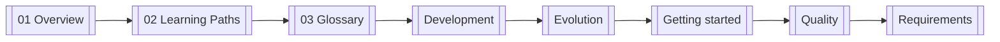

<!-- GENERATED BY build_obsidian_vaults.py -->
# ouroboros Guide - MOC

> [!info]
> output mode: hybrid  
> repo guide: `ouroboros-guide/`  
> repo-local note pack: `obsidian/ouroboros Guide/`  
> live vault target: `unset`  
> live sync status: `not applied`

## What this vault set is for

**"프롬프팅을 멈추고, 사양을 정의하라." -- Specification-First AI Development**

## Start here

1. [[01 Overview]]
2. [[02 Learning Paths]]
3. [[03 Glossary]]
4. [[Categories/Development]]
5. [[Categories/Evolution]]
6. [[Categories/Getting started]]
7. [[Categories/Quality]]
8. [[Categories/Requirements]]

## Reading graph

## Note map by purpose

### Categories
- [[Categories/Development]]
- [[Categories/Evolution]]
- [[Categories/Getting started]]
- [[Categories/Quality]]
- [[Categories/Requirements]]
### Frontdoor
- [[01 Overview]]
- [[02 Learning Paths]]
- [[03 Glossary]]

## Safety rule

> [!warning]
> repo-local pack가 정본이다. live vault sync는 의도된 target이 명시적으로 정해지기 전까지 보류한다.

## Repo links

- repo frontdoor: `README.md`
- repo ↔ note mapping: `OBSIDIAN-VAULT-MAP.md`
- sync evidence: `UPSTREAM-SNAPSHOT.md`, `SYNC-LOG.md`
